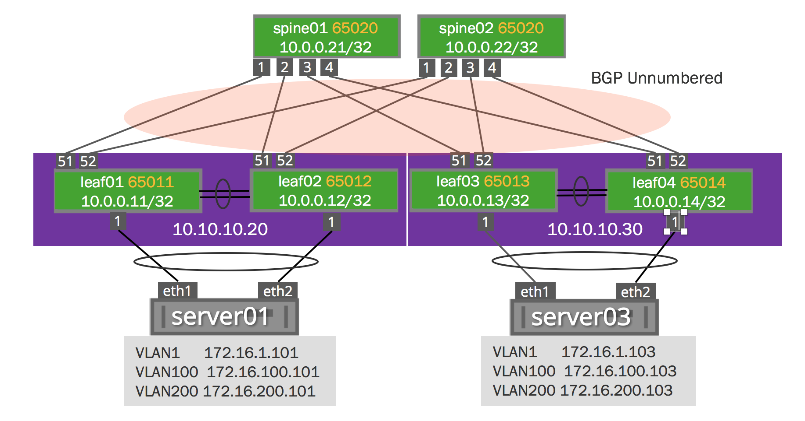

# Cumulus Networks EVPN Demos for [Cumulus VX](https://cumulusnetworks.com/products/cumulus-vx/)

Need help?  Post on the [Community](https://getsatisfaction.cumulusnetworks.com/cumulus) or join [Cumulus Slack](https://slack.cumulusnetworks.com/)

------------------------

This Github repository contains the configuration files necessary for setting up Openstack Pike with EVPN (Ethernet VPN) using Cumulus Linux and FRR on the [Reference Topology](http://github.com/cumulusnetworks/cldemo-vagrant).

The [configuration files](config/) in this repository will set up a BGP unnumbered routing fabric between the leafs and spines, and will use MLAG trunks between switches and the servers in that rack.

Quickstart: Dual-Attach (MLAG) Demo
------------------------
    git clone https://github.com/cumulusnetworks/cldemo-openstack
    cd cldemo-openstack
    git checkout cldemo-evpn
    vagrant up leaf01 leaf02 leaf03 leaf04 spine01 spine02 server01 server02 server03 server04
    vagrant ssh server01
    sudo su - cumulus
    ping 172.16.1.102
    ping 172.16.1.103
    ping 172.16.1.104

The ansible will change the subnet when it installs openstack.

[Troubleshooting Commands](https://docs.cumulusnetworks.com/display/DOCS/Ethernet+Virtual+Private+Network+-+EVPN#EthernetVirtualPrivateNetwork-EVPN-CumulusLinuxOutputCommands)    

## Install Openstack
--------------------
Copy and paste the setup script in the repo into a fresh Ubuntu 16.04 host to prepare it for running the cldemo-* topologies with vagrant + libvirt 

To deploy the Openstack hosts, simply execute: 
    ansible-playbook openstack.yml

### Detailed Instructions and Documentation
---------------------------------------
[EVPN Documentation](https://docs.cumulusnetworks.com/display/DOCS/Ethernet+Virtual+Private+Network+-+EVPN)
The EVPN Documentation was built around this demo and makes walking through this demo a breeze.  Please report problems with this demo using the "issues" tab above.

## Troubleshooting Commands

 * `bridge fdb show` shows the mac-address table for local and remote VTEPs
 * `show ip bgp summary` shows BGP IPv4 neighbor adjacencies
 * `show bgp evpn summary` shows BGP EVPN neighbor adjacencies
 * `show bgp evpn vni` shows VNIs that this device is participating in (only works on a VTEP)
 * `show evpn vni` shows remote VTEPs that share VNIs that this switch is participating in (only works on a VTEP)
 * `show evpn mac vni all` show MAC address information learned per VNI
 * `show bgp evpn route` show all EVPN routes

### Requirements
----------------------
[Vagrant](https://www.vagrantup.com/) (recommended 2.1.2)

and

[KVM](http://www.linux-kvm.org/page/Downloads)

Factory-reset a device
----------------------
    vagrant destroy -f leaf01
    vagrant up leaf01

Destroy the entire topology
---------------------------
    vagrant destroy -f

KVM Support
---------------------------
By default this Vagrantfile is setup for KVM.

All other directions remain the same

### Cumulus Linux
---------------------------------------
Cumulus Linux is a software distribution that runs on top of industry standard networking hardware. It enables the latest Linux applications and automation tools on networking gear while delivering new levels of innovation and flexibility to the data center.

For further details please see: [cumulusnetworks.com](http://www.cumulusnetworks.com)
